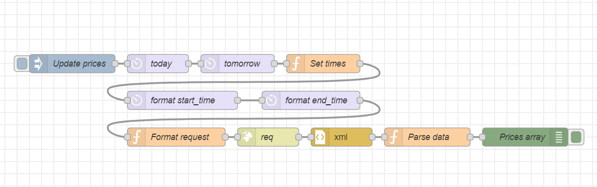

# tequ-solarctic-entso-e
Simple Node-RED flow to query future or historical electricity spot prices from ENTSO-E Transparency Platform.

### 1. Install Node.js & Node-RED

Follow instructions from
- https://nodejs.org/en
- https://nodered.org/docs/getting-started/


### 2. Install moment library for timestamp formatting

Use palette manager in Node-RED or run command in your Node-RED folder

```
npm install node-red-contrib-moment
```

### 3. Add your ENTSO-E API key as environmental variable "entsoe-apikey" in Node-RED settings.js file

Find and open settings.js from your Node-RED folder and add following line
```
process.env["entsoe-apikey"] = "YOUR_ENTSO-E_APIKEY"
```

### 4. Copy and import example flow into your Node-RED environment.

When you run the flow, it will return array of JSON objects, where "ts" is timestamp in UTC format and price is spot price €/kWh.
```
[
  {
    "ts":"2023-05-15T22:00:00.000Z",
    "price":0.57
  },
  ...
  {
    "ts":"2023-05-16T16:00:00.000Z",
    "price":0.57
  }
]
```



```
[{"id":"a12aa87b07091983","type":"inject","z":"9ede842aba8ef75a","name":"Update prices","props":[{"p":"payload"},{"p":"topic","vt":"str"}],"repeat":"","crontab":"","once":false,"onceDelay":"5","topic":"","payload":"","payloadType":"date","x":170,"y":620,"wires":[["be4a74d1ab677534"]]},{"id":"9107296ba421133e","type":"http request","z":"9ede842aba8ef75a","name":"req","method":"use","ret":"txt","paytoqs":"query","url":"","tls":"","persist":false,"proxy":"","insecureHTTPParser":false,"authType":"","senderr":false,"headers":[],"x":490,"y":740,"wires":[["270a407e38309ed6"]]},{"id":"7df0e75a29ef4ad9","type":"moment","z":"9ede842aba8ef75a","name":"format start_time","topic":"","input":"today","inputType":"msg","inTz":"Europe/Helsinki","adjAmount":0,"adjType":"days","adjDir":"add","format":"YYYYMMDDHHmm","locale":"en-US","output":"start_time","outputType":"msg","outTz":"ETC/UTC","x":350,"y":680,"wires":[["9b826bbcc668147c"]]},{"id":"9b826bbcc668147c","type":"moment","z":"9ede842aba8ef75a","name":"format end_time","topic":"","input":"tomorrow","inputType":"msg","inTz":"Europe/Helsinki","adjAmount":"0","adjType":"days","adjDir":"add","format":"YYYYMMDDHHmm","locale":"en-US","output":"end_time","outputType":"msg","outTz":"ETC/UTC","x":560,"y":680,"wires":[["c88a5a760cfee8cf"]]},{"id":"c88a5a760cfee8cf","type":"function","z":"9ede842aba8ef75a","name":"Format request","func":"let periodStart = msg.start_time \nlet periodEnd = msg.end_time\n\nlet params = {\n    \"securityToken\":env.get(\"entsoe-apikey\"),\n    \"documentType\": \"A44\",\n    \"in_Domain\": \"10YFI-1--------U\",\n    \"out_Domain\":\"10YFI-1--------U\",\n    \"periodStart\": periodStart,\n    \"periodEnd\": periodEnd\n}\n\nmsg.payload = params;\nmsg.url = \"https://web-api.tp.entsoe.eu/api\";\nmsg.method = \"GET\";\nreturn msg;","outputs":1,"noerr":0,"initialize":"","finalize":"","libs":[],"x":340,"y":740,"wires":[["9107296ba421133e"]]},{"id":"be4a74d1ab677534","type":"moment","z":"9ede842aba8ef75a","name":"today","topic":"","input":"","inputType":"date","inTz":"Europe/Helsinki","adjAmount":"1","adjType":"days","adjDir":"add","format":"YYYY-MM-DD","locale":"en-US","output":"today","outputType":"msg","outTz":"ETC/UTC","x":310,"y":620,"wires":[["15cb6df56c4a6fa1"]]},{"id":"15cb6df56c4a6fa1","type":"moment","z":"9ede842aba8ef75a","name":"tomorrow","topic":"","input":"","inputType":"date","inTz":"Europe/Helsinki","adjAmount":"2","adjType":"days","adjDir":"add","format":"YYYY-MM-DD","locale":"en-US","output":"tomorrow","outputType":"msg","outTz":"ETC/UTC","x":440,"y":620,"wires":[["e8ce5e0c17b16eb9"]]},{"id":"e8ce5e0c17b16eb9","type":"function","z":"9ede842aba8ef75a","name":"Set times","func":"msg.today = msg.today +\" 00:00:00\"\nmsg.tomorrow = msg.tomorrow + \" 00:00:00\"\n\nreturn msg;","outputs":1,"noerr":0,"initialize":"","finalize":"","libs":[],"x":580,"y":620,"wires":[["7df0e75a29ef4ad9"]]},{"id":"270a407e38309ed6","type":"xml","z":"9ede842aba8ef75a","name":"","property":"payload","attr":"","chr":"","x":610,"y":740,"wires":[["9c0d57d9d60e4ece"]]},{"id":"9c0d57d9d60e4ece","type":"function","z":"9ede842aba8ef75a","name":"Parse data","func":"function addHoursToDate(date, hours) {\n    date = new Date(new Date(date).setHours(date.getHours() + hours));\n    return date.toISOString();\n}\n\nlet data = msg.payload.Publication_MarketDocument.TimeSeries\nlet time_series_start_time = msg.payload.Publication_MarketDocument.TimeSeries[0].Period[0].timeInterval[0].start\nlet timeSeriesData = msg.payload.Publication_MarketDocument.TimeSeries\n\nlet dataPoints = []\nlet periodPoints;\nlet dataPoint = {}\nlet date = new Date(time_series_start_time)\nlet hours=0\n\nfor (var i = 0; i < timeSeriesData.length;i++){\n    \n    periodPoints = timeSeriesData[i].Period[0].Point\n\n    for (var j = 0; j < periodPoints.length;j++){\n        dataPoint = {\n            \"ts\": addHoursToDate(date,hours),\n            \"price\": Math.round((parseFloat(periodPoints[j][\"price.amount\"][0]/1000)*100)*100)/100\n        }\n        hours = hours + 1;        \n        dataPoints.push(dataPoint)\n    }\n}    \n\nmsg.time_series_start_time = time_series_start_time\nmsg.payload = dataPoints\nreturn msg;","outputs":1,"noerr":0,"initialize":"","finalize":"","libs":[],"x":750,"y":740,"wires":[["8c74bef3594f7c4b"]]},{"id":"8c74bef3594f7c4b","type":"debug","z":"9ede842aba8ef75a","name":"Prices array","active":true,"tosidebar":true,"console":false,"tostatus":false,"complete":"payload","targetType":"msg","statusVal":"","statusType":"auto","x":910,"y":740,"wires":[]}]
```
